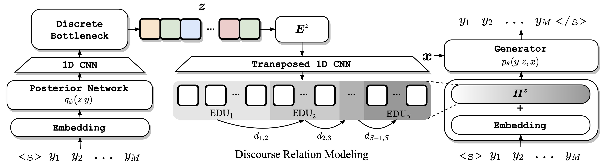

# DiscoDVT: Generating Long Text with Discourse-Aware Discrete Variational Transformer

## Introduction

This is the pytorch implementation of the paper "**DiscoDVT: Generating Long Text with Discourse-Aware Discrete Variational Transformer**". 



## Requirements

```
python >= 3.6
torch == 1.6.0
transformers == 4.0.0rc1
tensorboardX == 2.1
nltk == 3.4.5
```

## Pre-Trained Checkpoint

You first need to download the pre-trained checkpoint of `bart-base` from https://huggingface.co/facebook/bart-base (including `pytorch_model.bin`, `config.json`, `vocab.json`, `merges.txt`) into `models/bart-base`.

## Preprocessing

We provide the preprocessed data used in the paper [here](https://drive.google.com/file/d/1lBr35lsLZAPDMmuOaG5rPkxyuZiXhN4Z/view?usp=sharing) (*Wikiplots*, *WritingPrompts*) and overwrite the `data` folder.

You can also follow the following instructions to process your own data. 

Take *Wikiplots* as an example. First download the original data `plots.zip` from the [official repo](https://github.com/markriedl/WikiPlots).

Unzip the file, split the data, and save in `data/wikiplots.json`.

```bash
mv plots.zip data
unzip data/plots.zip
cd preprocess
python prepare_wikiplots.py
```

Before extracting discourse relations, you need to setup a corenlp server. Follow https://github.com/erindb/corenlp-ec2-startup to start a corenlp server in the backend. 

```bash
cd corenlp-ec2-startup
bash INSTALL.sh
bash SERVE.sh en
```

Extract discourse relations from the parsing outputs returned by the corenlp server. The parsing results will be saved in `data/wikiplots.json.bpe`.

```bash
cd preprocess
# extract discourse relations from wikiplots with 20 processes (optional, default is 10)
python extract_discourse.py wikiplots 20
# Encode the results into bpes
python encode_bpe.py wikiplots
```

# Generation

We provide model checkpoints trained on the two datasets described in our paper [here](https://drive.google.com/file/d/1a9lYeYJ4KmxY7SH0FOrQeaGCd4DBWYax/view?usp=sharing) which can be used for direct text generation. The following example generates stories conditioned on the first 1,000 prompts from the `test` set.

First sample latent codes from the prior model (`wikiplots` for example).

```bash
export DATA_NAME=wikiplots
python utils/prepare_code_gen.py ${DATA_NAME}
bash scripts/${DATA_NAME}_prior_code.sh
```

Then sample texts from the generation model given the latent codes and the prompt.

```bash
# arguments: data_name, paths to codes
python utils/prepare_gen.py ${DATA_NAME} models/prior-${DATA_NAME}/codes.txt 
bash scripts/${DATA_NAME}_gen.sh
```

# Evaluation

To evaluate the generated stories, you first need to extract the ground-truth stories from the dataset. Simply implemented as the following python codes (`wikiplots` for example):

```python
import json
# we only extract the first 1000 examples for evaluation
data = json.load(open("wikiplots.json", "r"))["test"]["tgt"][:1000]
with open("wikiplots_test.txt", "w") as f:
    for line in data:
        f.write(line + "\n")
```

Then evaluate the generation output with the following commands:

```bash
# General evaluation for BLEU-1/2, rBLEU-1/2, Distinct-4/5
python eval_general.py models/discoDVT_wikiplots/result.txt data/wikiplots_test.txt
# Evaluate the MSJ score
python eval_msj.py models/discoDVT_wikiplots/result.txt data/wikiplots_test.txt
# Evaluate the repetition score
python eval_rep.py models/discoDVT_wikiplots/result.txt
```

# Training

## Warm-Start

We provide the preprocessed subset of BookCorpus [here](https://drive.google.com/file/d/1f-PgrQ7S4WeN-1CldJR7zzqhunBjGVAv/view?usp=sharing) and the checkpoint of discoDVT_warmstart [here](https://drive.google.com/file/d/1dIYiRAu0YRddsqbYl8WhABOuA56PhHfh/view?usp=sharing).

```bash
# Save model parameters in discoDVT_warmstart
bash scripts/warm_start.sh
```

## Reconstruction

```bash
# Train the model on wikiplots
bash scripts/wikiplots_train.sh

# Train the model on writing prompts
bash scripts/wp_train.sh
```

## Train Prior

First generate posterior latent codes of the `train` and `valid` set. 
Take *Wikiplots* as an example:

```bash
export DATA_NAME=wikiplots
# Generate posterior latent codes of the train set
bash scripts/${DATA_NAME}_pos_code.sh train
# Generate posterior latent codes of the valid set
bash scripts/${DATA_NAME}_pos_code.sh valid
# Summarize into ${DATA_NAME}_code.json
python utils/prepare_pos_code.py ${DATA_NAME} discoDVT_${DATA_NAME}
```

Then train the prior network to predict the posterior latent codes.

```bash
bash scripts/${DATA_NAME}_train_prior.sh
```

# Citation

```
@inproceedings{ji2021DiscoDVT,
    title = "DiscoDVT: Generating Long Text with Discourse-Aware Discrete Variational Transformer",
    author = "Haozhe Ji and Minlie Huang",
    booktitle = "Proceedings of the 2021 Conference on Empirical Methods in Natural Language Processing",
    year = "2021",
}
```
**Please kindly cite our paper if you find this paper and the codes useful!**


